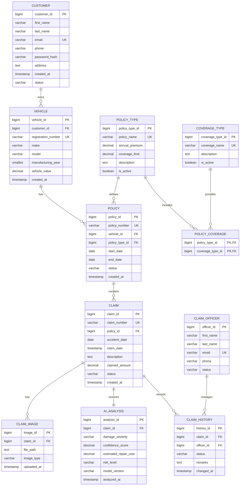

# ER Diagram — Draft

> **Status:** Database design in progress.
>
> This diagram represents the current proposed database structure. Attributes and relationships may change during database design review and AI/ML integration.

